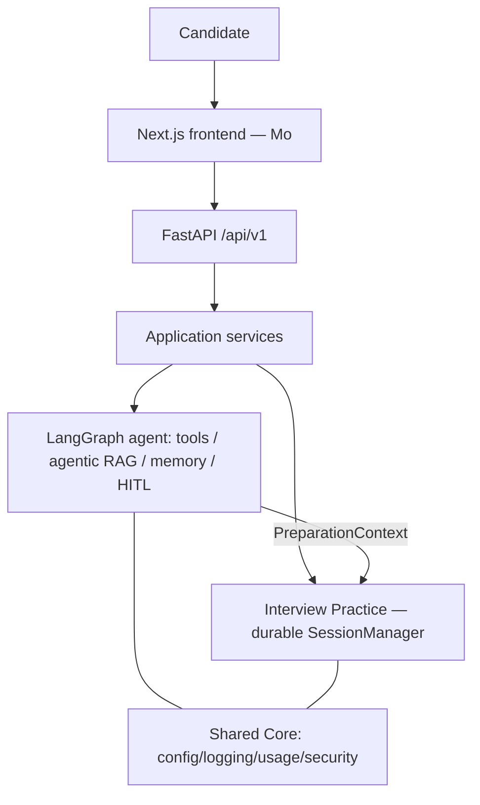

# Ask4Mo

**Intelligent Interview Coach**

**Ask More. Be More.**

Ask4Mo helps candidates understand what a role requires, prepare with evidence, practise
realistic interviews and improve through structured feedback.

**Mo** is the AI Coach. Underneath, Mo is a bounded **LangGraph Career Preparation
Agent** that chooses controlled tools, retrieves career evidence only when it is useful,
pauses for human approval where it matters, and hands the approved preparation into a
durable **Interview Practice** session.

## What it solves

Interview preparation is fragmented: candidates research a role in one place, guess their
gaps, and practise blind. Ask4Mo brings **understand → prepare → practise → improve** into
one flow, grounded in evidence and always under the candidate's control.

**Target users:** candidates preparing for professional, specialist and leadership
interviews.

## The candidate journey

```
Home  →  Ask Mo  →  Prepare  →  Practise  →  Progress
```

- **Understand** — Mo reads the role/JD and what it really requires.
- **Prepare** — Mo compares your background, retrieves grounded career evidence when
  useful, builds a focused plan and tailored questions, and remembers only what you
  approve.
- **Practise** — the approved preparation hands off into a realistic Interview Practice
  session (question → structured feedback → Deep Dive → final report).
- **Improve** — Progress and History let you return, review and prepare again.

## Architecture at a glance

Primary product stack: **Next.js + FastAPI**.

```
Next.js / TypeScript frontend        ← primary UI (Mo)
  → FastAPI backend (/api/v1)
    → Application services
      → LangGraph agent  (controlled tools · agentic RAG · memory · human-in-the-loop)
      → Interview Practice (durable, resumable SessionManager)
```

Mo is the **candidate-facing identity of the stateful LangGraph Career Preparation
Agent** — not a separate product, model or service. Deeper detail:
[docs/sprint4_architecture.md](docs/sprint4_architecture.md).

## Quick start

Two terminals, then open the app:

```bash
# Terminal 1 — FastAPI backend (http://localhost:8000, docs at /docs)
python -m venv .venv && source .venv/bin/activate
pip install -e .
AGENT_COACH_ENABLED=true OPENROUTER_API_KEY=... uvicorn src.api.main:app --reload

# Terminal 2 — Next.js frontend, the primary Ask4Mo UI (http://localhost:3000)
cd frontend && npm install && npm run dev
```

Open **http://localhost:3000**, type an interview goal on Home and press **Ask Mo**.

- **Minimum environment:** `OPENROUTER_API_KEY` (LLM-backed features) and
  `AGENT_COACH_ENABLED=true` (the Mo Agent Coach). The API's `FRONTEND_ORIGINS` defaults
  to `http://localhost:3000`. Advanced configuration (models, observability, speech/live)
  is covered under [Optional services](#optional-services) and the architecture docs.
- **Official interface:** Next.js + FastAPI. `streamlit run app.py` is a **legacy
  development interface only** — not the Ask4Mo reviewer experience.

### Knowledge base & citations (grounded evidence)

Mo shows **Sources/citations** only when the local knowledge base is built. **Datasets
are not committed**, so a fresh checkout starts with an *empty* KB — Mo then falls back to
an explicit "insufficient verified evidence" state rather than inventing citations (this
is why citations may appear missing on a clean clone). Build it from the local-first
loaders (see [Career Intelligence](#career-intelligence--sprint-3-foundation-now-behind-mo)):
`source_status`, `download_sources`, `normalise_roles`, `load_competencies`,
`load_labour_market`, `load_compensation`, then `rebuild_vector_index`. Once built, a
retrieval-worthy question (e.g. *"What skills and responsibilities are important for a
registered nurse?"*) returns visible **Sources** with O*NET/ESCO citations (verified: 5
sources, lane `structured_role`).

**Before a reviewer demo, confirm readiness in one command** (no provider/LLM call):

```bash
python scripts/check_demo_knowledge.py      # → "DEMO KNOWLEDGE: READY" (exit 0)
```

It reports each structured store, the vector-passage count and a deterministic retrieval
smoke query, and exits non-zero with the exact build commands if the KB is not built (a
clean clone has no local indexes, so this is expected on a fresh checkout).

## Current limitations

Honest, known follow-ups (not broken requirements):

- Production **OIDC** is not implemented (identity is a transitional, fail-closed
  boundary).
- Live **PostgreSQL** deployment validation remains a follow-up (SQLite for dev/tests).
- The **knowledge base must be provisioned/built** for evidence-backed retrieval and
  citations (datasets are not committed).
- **Live voice** remains experimental and **off by default**; there is no camera/visual
  coaching.

## Documentation

Reviewer package:

- [Submission summary](docs/sprint4_submission_summary.md) · [Reviewer guide](docs/sprint4_reviewer_guide.md) · [Reviewer Q&A](docs/sprint4_reviewer_qa.md)
- [Demo script](docs/sprint4_demo_script.md) · [Final requirements matrix](docs/sprint4_final_requirements_matrix.md)
- [Final evidence](docs/sprint4_final_evidence.md) (current verified test/eval numbers) · [Final evaluation](docs/sprint4_final_evaluation.md)
- [Architecture](docs/sprint4_architecture.md) · [Security & privacy](docs/sprint4_security_privacy.md) · [Interview parity](docs/sprint4_interview_parity.md)

Evaluation commands (no paid calls by default):

```bash
python scripts/eval_agent.py                      # deterministic agent orchestration + gates (56 cases)
python scripts/eval_agent_live.py                 # live-model harness: safe, no paid call (22 cases)
python scripts/eval_agent_live.py --allow-paid    # explicit paid live-model run (opt-in)
```

Deeper / historical foundation is preserved below and in the linked docs.

---

## Reference & historical foundation

Everything below is deeper reference material: the current system architecture, and the
**Sprint 3 Career Intelligence** domain foundation that now runs *behind* Mo. It is not
required to understand or demo the product — start with the front door above.

### System architecture

- **Shared Core** (`src/core/`) — infrastructure only: secrets, one composed `AppConfig`,
  safe logging, usage records, security primitives.
- **Career Intelligence** (`src/copilot/*`) — the domain engine: knowledge, retrieval,
  RAG, tools, security. Exposed to Mo through the agent's controlled tools.
- **Interview Practice** (`src/*.py`, `src/interview/*`) — the durable interview
  simulator (unchanged `SessionManager` state machine).
- **Integration** (`src/integration/`) — the only cross-module surface: the typed
  `PreparationContext` handoff. Career and Interview never import each other.
- **FastAPI** (`src/api/*`) over `src/application/*`; **Next.js** (`frontend/*`) is the
  primary client; the **LangGraph agent** (`src/agent/*`) powers Mo. Full phase-by-phase
  detail lives in [docs/sprint4_architecture.md](docs/sprint4_architecture.md).



**Trust / security boundaries**

```mermaid
flowchart TD
    SYS[System rules — trusted] --> OUT[Answer]
    TOOL[Registered tool output — controlled] --> OUT
    subgraph Untrusted["Untrusted data (never instructions)"]
      USER[User input] --> SCAN[Injection scan]
      JOBD[Job description] --> SCAN
      CAND[Candidate context] --> SCAN
      DOCS[Retrieved chunks] --> SCREEN[RAG guard]
    end
    SCAN --> OUT
    SCREEN --> OUT
    OUT --> OG[Output guard: redact secrets / valid citations]
```



Security highlights: prompt-injection scanning on all untrusted input; retrieved text is
**data, never instructions**; tools are a fixed registry (no `eval`/shell/network);
secrets via `SecretStr`, never logged; output guard redacts secret-like strings and keeps
citations valid. See [docs/security.md](docs/security.md).

### Career Intelligence — Sprint 3 foundation (now behind Mo)

The Career Intelligence layer began as the Turing College "Building Applications with AI"
(Sprint 3) deliverable and is now the **domain foundation used behind Mo** — not a second
product. Mo's `SearchCareerKnowledge` tool calls this engine's **retrieval-only**
operation: the agent decides *whether* to retrieve, while the deterministic router decides
*which* lanes/sources.

It is a **multi-source knowledge system**, not one vector store: a deterministic router
sends each question to the right lane across five stores — a **Role DB**
(ESCO/O*NET/ISCO/KldB/BLS OOH), a **Competency DB** (DigComp/NICE/e-CF/OPM/UK Civil
Service), a **Compensation DB** (OEWS/ASHE/Eurostat/Entgeltatlas), a **Labour-Market DB**
(Cedefop forecast/openings/shortage), and **Vector Knowledge** (narrative docs in Chroma)
— every record carrying provenance and source authority, with geographic precedence for
country-specific questions.

```
 Role DB   Competency DB   Compensation DB   Labour-Market DB   Vector Knowledge
     └──────────────┴──────────────┬──────────────┴───────────────┘
                          Deterministic Router (+ geo precedence)
                                    ↓
                        Grounded answer (with provenance)
```

The build is **local-first**: real source files under `data/raw/` are inventoried and
loaded in place; no datasets are committed. Reproduce with the `scripts/*` loaders
(`source_status`, `download_sources`, `normalise_roles`, `load_competencies`,
`load_labour_market`, `load_compensation`, `rebuild_vector_index`). Measured counts live in
[docs/metrics_snapshot.md](docs/metrics_snapshot.md); details in
[docs/knowledge_architecture.md](docs/knowledge_architecture.md),
[docs/knowledge_source_catalogue.md](docs/knowledge_source_catalogue.md) and
[docs/legacy_sprint3_architecture.md](docs/legacy_sprint3_architecture.md).

Representative sources (full list + licences in the catalogue):

| Source | Publisher | Group | Geo | Licence note |
| --- | --- | --- | --- | --- |
| O*NET | US DOL | occupations | US | CC BY 4.0 |
| ESCO | European Commission | occupations/skills | EU | review before reuse |
| ISCO-08 | ILO | occupation hierarchy | global | review before reuse |
| BLS Occupational Outlook Handbook | US BLS | occupations | US | public domain (US gov) |
| DigComp | European Commission (JRC) | skills | EU | review before reuse |
| NICE Framework | NIST | skills (cyber) | US | public domain (US gov) |
| OEWS / ASHE / Eurostat / Entgeltatlas | BLS / ONS / Eurostat / BA | compensation | US/UK/EU/DE | public domain / OGL / CC BY / review |
| Cedefop forecast / openings / shortage | Cedefop | labour market | EU | review before reuse |

**Controlled domain tools** (allowlisted; no arbitrary code): Job Description Analyzer
(LLM), Candidate Gap Analyzer (deterministic), Preparation Plan Calculator
(deterministic), Interview Question Generator (LLM), and `SearchCareerKnowledge`
(retrieval-only). See [docs/tool_calling.md](docs/tool_calling.md).

**RAG evaluation** is versioned and offline-first (deterministic retrieval metrics are the
CI gate; RAGAS is an optional, opt-in generation-quality layer that never runs in normal
CI). Current figures live in [docs/metrics_snapshot.md](docs/metrics_snapshot.md) and
[docs/sprint4_final_evidence.md](docs/sprint4_final_evidence.md); RAG design in
[docs/rag.md](docs/rag.md) and [docs/ragas_evaluation.md](docs/ragas_evaluation.md).

### Interview Practice (module)

Realistic interview simulation: configuration (with restored Sprint-1 options — question
types, difficulty), durable sessions, tailored questions, structured evaluation, Interview
Deep Dive, final report, and refresh/restart resume. **Text Practice is complete**;
**Record** (Google Speech) degrades to text without the `[speech]` extra; **Live** (Gemini)
is experimental and hidden behind `INTERVIEW_LIVE_ENABLED`. There is **no camera/visual
coaching**. See [docs/sprint4_interview_parity.md](docs/sprint4_interview_parity.md).

### Optional services

- **Record** (voice answers): `pip install -e ".[speech]"` + a Google Speech project;
  degrades to text otherwise.
- **Live** (Gemini): experimental, OFF by default; needs `INTERVIEW_LIVE_ENABLED=true`,
  `pip install -e ".[live]"` and a key.
- **External observability (Langfuse):** optional, OFF by default; the first-party Agent
  Inspector is the primary view. Opt in with `pip install -e ".[observability]"` +
  `AGENT_EXTERNAL_OBSERVABILITY_ENABLED=true`; only a sanitised operational projection is
  ever sent.
- **RAGAS:** optional (`pip install -e ".[evaluation]"`), manual/paid, never in CI.

### Testing

```bash
pytest -q                                        # full Python suite
python -m compileall -q app.py src scripts tests # compile check
ruff check .                                     # lint
cd frontend && npm run lint && npm test && npm run typecheck && npm run build && npm run e2e
```

Current verified counts are kept in one place —
[docs/sprint4_final_evidence.md](docs/sprint4_final_evidence.md) — rather than duplicated
here.

### Historical Sprint documentation

This project began as a Turing College Sprint 1 interview app and grew into Ask4Mo. The
original standalone Sprint 1 manual was removed to avoid contradictory docs; it remains in
git history. Historical architecture notes:
[docs/legacy_sprint3_architecture.md](docs/legacy_sprint3_architecture.md) and the other
files under [`docs/`](docs/).
