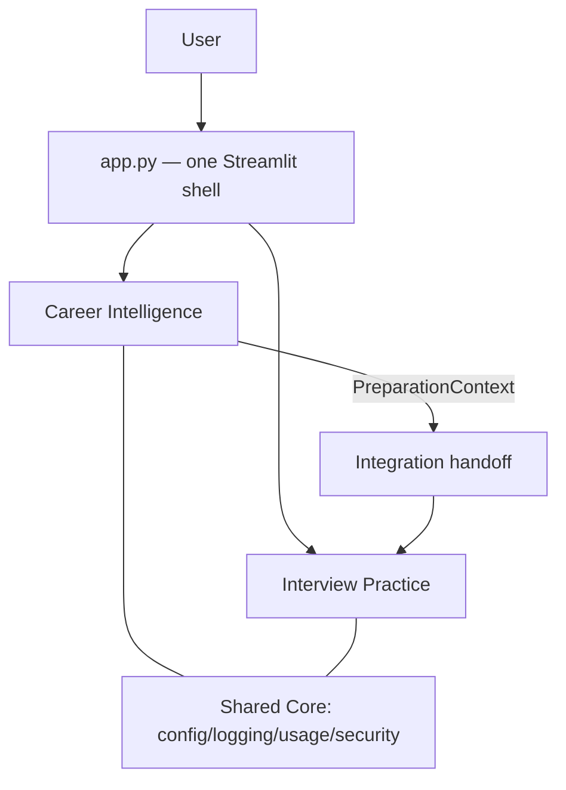
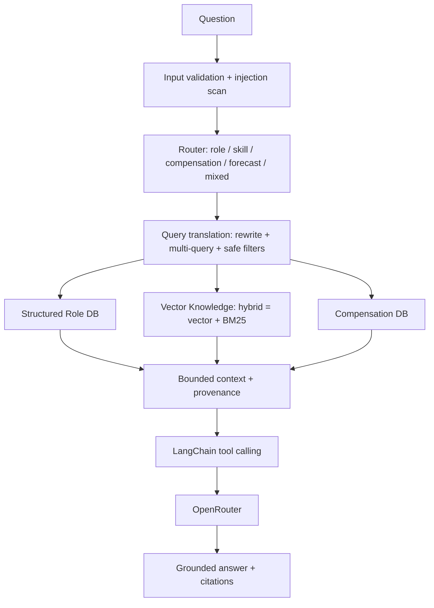
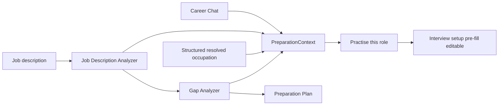
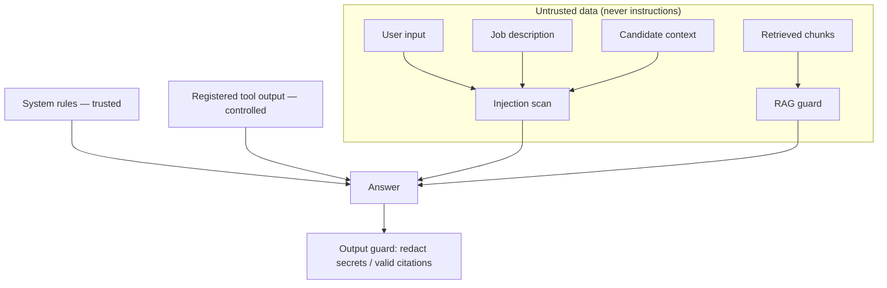

# Intelligent Interview Coach

**Understand the opportunity. Prepare intelligently. Practise realistically.**

## What it solves

Intelligent Interview Coach solves the **fragmentation of interview preparation**.
Candidates typically research roles, analyse job descriptions, identify gaps, plan
preparation and practise interviews across disconnected tools. The application
brings these activities into one workflow.

In **Sprint 4**, the product evolves from a primarily retrieval/workflow-driven
career preparation system into a **stateful AI agent**. The agent will decide which
controlled tools it needs, whether career retrieval is necessary, when
clarification or human approval is required, and how preparation context should
carry into Interview Practice.

**Target users:** candidates preparing for professional, specialist and leadership
interviews.

### Sprint 4 architectural goal (planned)

```
Next.js / TypeScript frontend
  → FastAPI Python backend
    → LangGraph agent (stateful orchestration)
      → controlled tools / agentic RAG / memory / human-in-the-loop
        → Interview Practice
```

> **Status:** the components above are **Planned for Sprint 4** and are *not yet
> implemented*. This phase (Phase 0) only establishes the Sprint 4 baseline,
> branding and planning documents — see
> [docs/sprint4_roadmap.md](docs/sprint4_roadmap.md),
> [docs/sprint4_architecture.md](docs/sprint4_architecture.md) and
> [docs/sprint4_requirements_map.md](docs/sprint4_requirements_map.md). The
> current shipping product remains the Streamlit application described below.

## Current product (Sprint 3)

Intelligent Interview Coach is one Streamlit application (`streamlit run app.py`, one URL)
that combines two product modules:

- **Career Intelligence** — evidence-grounded career guidance and interview
  preparation using RAG over a labour-market/careers knowledge base: LangChain +
  OpenRouter, embeddings, Chroma vector search, BM25 + hybrid retrieval, advanced
  query translation, four domain tool calls, citations, and prompt-injection
  security. Code: `src/career/ui.py` (UI) over the engine in `src/copilot/*`.
- **Interview Practice** — realistic interview simulation, rubric evaluation,
  Interview Deep Dive, final report, and voice/live practice with delivery
  coaching. Code: `src/interview/studio_app.py` over `src/*.py`.

Platform workflow: **UNDERSTAND → PREPARE → PRACTISE → REVIEW → IMPROVE**
(Career Intelligence covers Understand & Prepare; Interview Practice covers
Practise, Review & Improve). The two modules keep clear boundaries and are each
independently testable; see [docs/interview_os_architecture.md](docs/interview_os_architecture.md).

**Navigation.** The sidebar has a **primary product journey** (Home, Career
Intelligence, Interview Practice, Knowledge Base) and a separate **Review &
diagnostics** section lower down with **RAG Inspector** (how the last question was
understood and retrieved) and **Evaluation** (measured RAG/tool/product-coverage
results). Both diagnostic pages are always accessible; reviewer mode
(`COPILOT_REVIEWER_MODE`) is presentational only and no longer gates access.

**Career Intelligence is a multi-source knowledge system**, not just a vector
store: a deterministic router sends each question to the right lane across five
stores — a **Role DB** (ESCO/O*NET/ISCO/KldB/BLS OOH), a **Competency DB**
(DigComp/NICE/e-CF/BA/OPM/UK Civil Service), a **Compensation DB**
(OEWS/ASHE/Eurostat/Entgeltatlas), a **Labour-Market DB** (Cedefop
forecast/openings/shortage), and **Vector Knowledge** (narrative docs in Chroma) —
every record carrying provenance and source authority, with geographic source
precedence for country-specific questions. Authoritative sources are configured
(see [docs/knowledge_source_catalogue.md](docs/knowledge_source_catalogue.md)),
each tracked through a measured lifecycle in `data/source_status.json` — a source
in the manifest is never assumed loaded. The build is **local-first**: real source
files under `data/raw/` are inventoried and loaded in place (O*NET 31.0, ESCO
v1.2.1, ISCO-08, KldB, BLS OEWS/OOH/Employment Projections, ONS ASHE, NICE 2.2.0,
DigComp 2.2, Cedefop CLSSI, Eurostat JVS as structured data; WEF, ESCO handbook,
EQF, OPM, Civil Service as narrative). **Current measured counts live in one
generated place — [docs/metrics_snapshot.md](docs/metrics_snapshot.md)**
(configured / retrieval-ready / production-ready sources, record counts, and
production readiness by coverage area), refreshed by `python scripts/gen_metrics.py`.
See [docs/local_source_report.md](docs/local_source_report.md) and
[docs/knowledge_coverage_report.md](docs/knowledge_coverage_report.md). See
[docs/knowledge_architecture.md](docs/knowledge_architecture.md). No datasets are
committed; reproduce with the `scripts/*` loaders (`source_status`,
`download_sources`, `normalise_roles`, `load_competencies`, `load_labour_market`,
`load_compensation`, `rebuild_vector_index`).

**RAG evaluation is versioned.** Phase 11R established the baseline benchmark
(`evaluations/retrieval_results.csv`, `rag_evaluation.md`), preserved unchanged
and copied to `evaluations/baseline/`. Phase 11R-A **measured** the expanded
multi-lane architecture (router / structured-role / compensation / provenance) —
see `evaluations/expanded_architecture_evaluation.md`. Core vector/keyword/hybrid
metrics are unchanged vs the baseline (the architecture adds lanes, it does not
alter narrative retrieval); the gain is coverage of structured role and
compensation questions. Reproduce with `python scripts/eval_expanded.py` (it
never overwrites the 11R baseline).

**Two-level evaluation.** The deterministic retrieval metrics above are the
primary, offline CI gate — they measure whether the right evidence was retrieved.
An **optional** secondary layer, **RAGAS**, measures the *generation* itself
(Faithfulness, Response Relevancy, Context Precision, Context Recall) using an LLM
evaluator. RAGAS is not the production RAG engine and does not replace the custom
metrics; it is opt-in (`pip install -e ".[evaluation]"`), runs only on public
held-out cases, never in normal CI, and reports a clean NOT RUN without evaluator
credentials. It runs from the CLI (`python scripts/eval_ragas.py --live`) or
explicitly from the Evaluation page (fixed scopes, cost-confirmation gated); both
share one runner and failed evaluator runs never become baselines. See
[docs/ragas_evaluation.md](docs/ragas_evaluation.md).

### Current Sprint: Career Intelligence

The **Career Intelligence** module is the active Turing College sprint ("Building
Applications with AI"). It implements the sprint's **Advanced RAG** (knowledge
base, chunking, embeddings, vector retrieval, query translation, structured
retrieval, hybrid search), **Tool Calling** (four domain tools via LangChain),
**LangChain** orchestration over **OpenRouter**, domain specialisation, and
**prompt-injection security**. A full requirement→location map (with tests) is in
[docs/sprint_requirements_after_integration.md](docs/sprint_requirements_after_integration.md),
and the RAG/LangChain design in [docs/rag.md](docs/rag.md),
[docs/query_translation.md](docs/query_translation.md),
[docs/hybrid_search.md](docs/hybrid_search.md),
[docs/tool_calling.md](docs/tool_calling.md) and
[docs/security.md](docs/security.md).

## Why it exists

Interview preparation is usually fragmented: you research a role in one place,
guess your gaps, and practise blind. Intelligent Interview Coach joins the two halves —
**understand the role with evidence, then practise for it** — in one flow:

```
Understand role → identify gaps → prepare → practise → review → improve
```

## Current Turing sprint scope

The current **Building Applications with AI** sprint is represented primarily by
the **Career Intelligence** module. It demonstrates: LangChain, advanced RAG,
embeddings, vector retrieval, query translation, structured retrieval, hybrid
retrieval, tool calling, domain security, Streamlit and OpenRouter. The older
**Interview Practice** module existed **before** this sprint and is not part of
the sprint deliverable — it provides the real-world use case the sprint work
plugs into.

## Architecture

Modular monolith, one Streamlit process:

- **Shared Core** (`src/core/`) — infrastructure only: secrets, one composed
  `AppConfig`, safe logging, usage records, generic security primitives.
- **Career Intelligence** (`src/copilot/*`, UI `src/career/ui.py`) — the sprint
  module: knowledge, retrieval, RAG, tools, security, evaluation.
- **Interview Practice** (`src/*.py`, UI `src/interview/studio_app.py`) — the
  pre-existing interview simulator.
- **Integration** (`src/integration/`) — the only cross-module surface: the
  `PreparationContext` contract + the "Practise this role" handoff. Career and
  Interview never import each other.

### Architecture diagrams

**Platform**



**Career Intelligence retrieval**



**Career → Interview handoff**

Both Career surfaces — **Career Chat** and **Career Tools** — can hand off to
Interview Practice through the same `PreparationContext` and the one
**Practise this role** action. A target role is mandatory and never fabricated:
it comes from an explicit user-confirmed role, the Job Description Analyzer's
`role_title`, or a structured resolved occupation, and the user is asked to
confirm it when none is found. The handoff pre-fills an **editable** interview
setup and never starts an interview automatically.



**Trust / security boundaries**



## Knowledge architecture

Career Intelligence is a **multi-source** system, not one vector store:

```
 Role DB   Competency DB   Compensation DB   Labour-Market DB   Vector Knowledge
 (ESCO/    (DigComp/NICE/  (OEWS/ASHE/       (Cedefop           (reports/
  O*NET/    e-CF/BA/OPM/    Eurostat/         forecast/          frameworks)
  ISCO/     Civil Service)  Entgeltatlas)     openings/
  KldB/                                       shortage)
  BLS OOH)
     └──────────────┴──────────────┬──────────────┴───────────────┘
                          Deterministic Router (+ geo precedence)
                                    ↓
                        Grounded answer (with provenance)
```

**Why not everything in Chroma:** occupations/skills/competencies are relational
and enumerable (a taxonomy lookup, not nearest-prose); compensation and
labour-market data are tabular and context-bound
(currency/period/geography/year); only narrative belongs in vectors. Details:
[docs/knowledge_architecture.md](docs/knowledge_architecture.md).

## Knowledge sources

Authoritative sources are configured in
[data/source_manifest.json](data/source_manifest.json); each has a measured
lifecycle in `data/source_status.json` (counts in
[docs/metrics_snapshot.md](docs/metrics_snapshot.md)). Full list with lifecycle
and licence: [docs/knowledge_source_catalogue.md](docs/knowledge_source_catalogue.md). **No
datasets are committed** (see [docs/source_licensing.md](docs/source_licensing.md)).
A representative subset:

| Source | Publisher | Group | Geo | Licence note |
| --- | --- | --- | --- | --- |
| O*NET | US DOL | occupations | US | CC BY 4.0 |
| ESCO | European Commission | occupations/skills | EU | review before reuse |
| ISCO-08 | ILO | occupation hierarchy | global | review before reuse |
| KldB / BERUFENET | Bundesagentur für Arbeit | occupations | DE | review before reuse |
| BLS Occupational Outlook Handbook | US BLS | occupations | US | public domain (US gov) |
| DigComp | European Commission (JRC) | skills | EU | review before reuse |
| NICE Framework | NIST | skills (cyber) | US | public domain (US gov) |
| e-CF | CEN | skills | EU | review before reuse |
| UK Civil Service Success Profiles | Cabinet Office | job architecture | UK | OGL v3.0 |
| OPM qualification standards | US OPM | job architecture | US | public domain (US gov) |
| OEWS / ASHE / Eurostat / Entgeltatlas | BLS / ONS / Eurostat / BA | compensation | US/UK/EU/DE | public domain / OGL / CC BY / review |
| Cedefop forecast / openings / shortage | Cedefop | labour market | EU | review before reuse |
| ESCO handbook / WEF Future of Jobs | EC / WEF | narrative | EU/global | review before reuse |

## RAG flow

```
User → intent/routing → query translation → structured/vector/compensation
retrieval → tool calling → grounded answer → citations
```

## Tool calling

Four domain tools via LangChain (registered set only — no arbitrary code):

- **Job Description Analyzer** (LLM) — structured role requirements.
- **Candidate Gap Analyzer** (deterministic) — matched/partial/missing + match %
  computed in Python.
- **Preparation Plan Calculator** (deterministic) — time-boxed plan, Python
  arithmetic.
- **Interview Question Generator** (LLM) — categorised questions.

Details: [docs/tool_calling.md](docs/tool_calling.md).

## RAG evaluation

Actual results (committed synthetic corpus; local embedder). See
[evaluations/rag_evaluation.md](evaluations/rag_evaluation.md) and
[evaluations/expanded_architecture_evaluation.md](evaluations/expanded_architecture_evaluation.md).

**11R baseline** (33 cases, top_k=5):

| mode | Hit@5 | MRR | Recall@5 |
| --- | --- | --- | --- |
| vector | 0.97 | 0.842 | 0.955 |
| keyword | 0.97 | 0.904 | 0.97 |
| hybrid | 0.939 | 0.871 | 0.924 |

Honest finding: on this corpus with a lexical embedder, **keyword edges out
hybrid** — reported, not rewritten. Tool selection 1.0; citation validity 1.0.

**11R-A expanded architecture:** routing accuracy **1.0**, structured-role hit
**1.0** / provenance **1.0**, compensation accuracy **1.0** / provenance **1.0**.
Core vector/keyword/hybrid metrics are **unchanged vs baseline (Δ = 0)** — the
expansion adds lanes and coverage, it does not change narrative retrieval. No
improvement is claimed where the numbers do not show one.

**KB-2 knowledge expansion (historical):** lane routing **1.0** and geographic
precedence **1.0** over labelled cases; at KB-2, coverage was 16/25 sources with
53 structured records from offline samples. Reproduce with
`python scripts/eval_knowledge_expansion.py`; it writes only under
`evaluations/knowledge_expansion/` and never touches the 11R / 11R-A artifacts.

**Product coverage (current, CI-PH4+):** a 400+ case candidate-question benchmark
over the production-ready real sources — see
[docs/metrics_snapshot.md](docs/metrics_snapshot.md) for current routing /
geo-source / Hit@5 / citation / salary-context / tool-selection /
insufficient-evidence scores and production readiness by coverage area, and
[evaluations/product_coverage/summary.md](evaluations/product_coverage/summary.md)
for the full run. The overall production-readiness verdict is in
[docs/career_intelligence_production_readiness.md](docs/career_intelligence_production_readiness.md).

## Security

- Prompt-injection scanning on all untrusted input (query, job description,
  candidate background); blocked attacks are refused.
- **Retrieved text is data, never instructions** — injected chunks are excluded.
- Tools are a fixed registry — no `eval`/shell/filesystem/network.
- Secrets via `SecretStr`, read from Streamlit secrets → env, never logged.
- Logging policy redacts candidate/JD/chunk/transcript/content; safe metadata
  only. Output guard redacts secret-like strings. See
  [docs/security.md](docs/security.md).

## Installation

```bash
python -m venv .venv && source .venv/bin/activate
pip install -e .           # runtime (includes RAG: Chroma + BM25)
pip install -e ".[dev]"    # + test tooling
```

Optionally add an OpenRouter key to `.streamlit/secrets.toml` or the environment
(`OPENROUTER_API_KEY`). The app boots without a key (with clear notices).

## Running

```bash
streamlit run app.py
```

One process, one URL. Everything (both modules) lives here.

## Optional services

- **Record** (voice answers) needs `pip install -e ".[speech]"` + a Google Speech
  project; without it, Record degrades to text.
- **Live** (Gemini) is **experimental and OFF by default**. It appears only when
  `INTERVIEW_LIVE_ENABLED=true` and also needs `pip install -e ".[live]"` + a
  Gemini key + the built frontend; without any of these, Live is hidden and the
  app runs on Text/Record. The browser component owns the hardened live lifecycle
  (provider-driven barge-in, token-expiry refresh, bounded reconnect), covered by
  the frontend unit suite. There is **no camera/visual coaching** — the product
  never requests camera access (asserted by an e2e test).

## API (Sprint 4 Phase 2)

A thin, typed **FastAPI** backend (`src/api`) serves the same application layer as
the Streamlit UI — both coexist. Run it locally:

```bash
uvicorn src.api.main:app --reload        # interactive docs at /docs
```

Base path is `/api/v1` (plus `/api/health` for infra liveness). It exposes career
chat + tools, the interview lifecycle, user-scoped history, and read-only
knowledge/evaluation status. CORS origins come from `FRONTEND_ORIGINS` (defaults to
`http://localhost:3000` in development). The Docker image can serve the API via a
command override — see the Dockerfile. **Next.js and LangGraph are still planned**
(later Sprint 4 phases); Career routing remains deterministic.

## Frontend (Sprint 4 Phase 3B)

A production frontend **foundation** lives in [`frontend/`](frontend/) — Next.js 15
(App Router) + React 19 + TypeScript + Tailwind, implementing the selected
**Precision Coach** design system (`docs/design/phase3a/`). It's a typed client of
the FastAPI backend; Streamlit keeps working alongside it.

```bash
# Terminal 1 — backend
uvicorn src.api.main:app --reload
# Terminal 2 — frontend
cd frontend && npm install && npm run dev   # http://localhost:3000
```

**Prepare is live** (Phase 3C): the coach, the four preparation tools, sources and
the Career→Interview handoff all run against the FastAPI contracts. Retrieval stays
deterministic (agentic RAG is a later phase). See
[frontend/README.md](frontend/README.md).

A **LangGraph agent** (Phases 4–9) runs side-by-side with the deterministic Career
flow: a single, stateful, bounded, tool-using agent (`src/agent`) behind
`POST /api/v1/agent/run` — it does **not** replace `/career/chat`. It
wields **five real Career tools** as allowlisted functions, selecting and sequencing
them by intent: job-description analysis, gap analysis, preparation plan, question
generation, and — new in **Phase 6 (Agentic RAG)** — `SearchCareerKnowledge`.
Retrieval is now **conditional and tool-selected**: the agent decides *whether*
external career evidence is needed, while the deterministic Sprint 3 router still
decides *which* lanes/sources (the model never touches low-level vector/BM25/
repository stores). `SearchCareerKnowledge` runs a **retrieval-only** operation
(`search_knowledge` → `retrieve_evidence`) that shares its extraction with the full
`answer()` pipeline but runs **no** other Career tools and **no** final answer
synthesis — it returns evidence, and the agent decides what to say. Retrieved
content stays untrusted data and citations come only from retrieved evidence.

**Selective long-term preparation memory** (Phase 7) is a *separate*, durable,
user-scoped store (`preparation_memories`, Alembic `0002`) from the agent's transient
run state. It keeps only concise, structured preparation facts — recurring gaps,
strengths, completed topics, preferences, goals, target roles — **never** whole
conversations, JDs, CVs, transcripts or answers, and no protected-trait categories.
Writes are **explicit and user-initiated** via `POST/GET/DELETE /api/v1/memory`
(the agent never persists memory automatically — that's Phase 8 HITL). At the start
of a run the agent loads a bounded, deterministic set (role-matched then general; no
vector search, no extra model call) and treats it as user-approved **DATA** (never
instructions; the current request always takes precedence). The `/progress` page
shows what the coach remembers, grouped, with delete.

**Human-in-the-loop** (Phase 8) uses LangGraph's real `interrupt`/`Command(resume)`
so the agent pauses for decisions that shouldn't be autonomous — confirming an
ambiguous target role, approving a proposed preparation memory before it is saved,
and approving the hand-off into Interview Practice — then resumes the **same** run.
Paused runs persist in an official durable checkpoint (SQLite locally, PostgreSQL in
production) so they survive a refresh or restart; ownership and every decision are
validated server-side (a human response is untrusted input), and the durable
checkpoint (execution state) is kept separate from long-term memory (approved
knowledge). Owner-scoped `GET`/`POST .../agent/runs/{id}[/resume]` drive it.

**Agent Coach + Agent Inspector** (Phase 9) make the agent a candidate-facing product.
When the backend advertises `agent_coach_enabled` (env `AGENT_COACH_ENABLED`),
`/prepare` talks directly to the LangGraph agent behind the Precision Coach UI;
otherwise it stays on the deterministic Career flow (safe rollback). A conversation
stays on **one checkpointed thread** — follow-ups continue the same run
(`POST /agent/runs/{id}/messages`), each user turn gets a fresh bounded step
allowance, and refresh restores the run from `?run=<id>` (a random, owner-scoped id;
no private content in the URL or `localStorage`). HITL appears as approval cards
(role / memory / practice handoff); an approved handoff creates the interview in the
frontend and routes to `/practice`. The **Agent Inspector** (`/review/agent`) shows
owner-scoped, observable execution only — tools, retrieval, sources, memory use and
human approvals — never chain-of-thought, prompts or raw checkpoint state.
See [docs/sprint4_architecture.md](docs/sprint4_architecture.md).

## Testing

```bash
pytest                                   # full Python suite
python -m compileall -q app.py src       # compile check
python scripts/eval_rag.py               # 11R RAG benchmark
python scripts/eval_expanded.py          # 11R-A expanded evaluation
(cd components/live_interviewer/frontend && npm test)   # frontend (vitest)
```

Latest: **1484 passed, 2 skipped** (Python; skips are the RAGAS installed/absent
guards); **51 passed** (frontend). Browser E2E: **21 passed** (Playwright/chromium).

## Known limitations

- Real datasets are not committed; the shipped corpus/samples are synthetic, so
  absolute evaluation numbers reflect that.
- The offline/local embedder is lexical; semantic vector quality needs an OpenAI
  embedding key.
- Deterministic injection defence is best-effort, not a guarantee.
- Structured lanes (role/competency/compensation/labour-market) now participate
  directly in the production chat answer: the router drives a
  `StructuredRetrievalCoordinator` that queries the real stores, resolves the
  occupation, applies geographic source precedence, and merges typed evidence with
  vector RAG — each fact cited to its source. Occupation resolution is lexical, so
  unusual phrasings may need clarification.
- Live LLM/Speech/Gemini paths require credentials and are not exercised in CI.

## Future roadmap (post-sprint)

- Richer occupation resolution (embeddings/crosswalks) and per-source task text
  for ESCO; deeper multi-source evidence merging.
- Real dataset ingestion + semantic embeddings; labelled relevance judgements.
- Deeper interview↔career loop (feed interview outcomes back into preparation).

## Documentation

Reviewer-facing: [docs/reviewer_guide.md](docs/reviewer_guide.md),
[docs/assignment_traceability.md](docs/assignment_traceability.md),
[docs/demo_script.md](docs/demo_script.md),
[docs/team_leader_direction.md](docs/team_leader_direction.md),
[docs/rebuild_knowledge_base.md](docs/rebuild_knowledge_base.md),
[docs/source_licensing.md](docs/source_licensing.md).

---

## Interview Practice (module)

**Prepare for any role. Practise realistically. Improve every answer.**

> **Status note (mode readiness).** **Text Practice is complete and fully
> working.** **Record** (Google Speech-to-Text) is wired end to end and degrades
> to Text without the `[speech]` extra + credentials. **Live** (Gemini Live) is
> **experimental and hidden by default** behind `INTERVIEW_LIVE_ENABLED`; its
> browser lifecycle (barge-in, token expiry, bounded reconnect) is hardened and
> unit-tested, but it is not exposed publicly and makes no paid calls in CI. There
> is **no camera/visual coaching** — that feature was withdrawn and the product
> never requests camera access. Voice/Live always fall back gracefully (no
> crashes, no lost progress). See
> [docs/product_readiness_report.md](docs/product_readiness_report.md).

---

## Historical Sprint 1 documentation

This project began as a Turing College Sprint 1 interview app and has since
grown into the unified **Intelligent Interview Coach** described above. The original
standalone Sprint 1 manual has been removed to avoid two contradictory sets of
docs; it remains available in the project's git history. Current, authoritative
documentation lives under [`docs/`](docs/) — see `docs/architecture.md`,
`docs/rag.md`, `docs/ragas_evaluation.md`, `docs/reviewer_guide.md` and
`docs/operations_deployment.md`.

