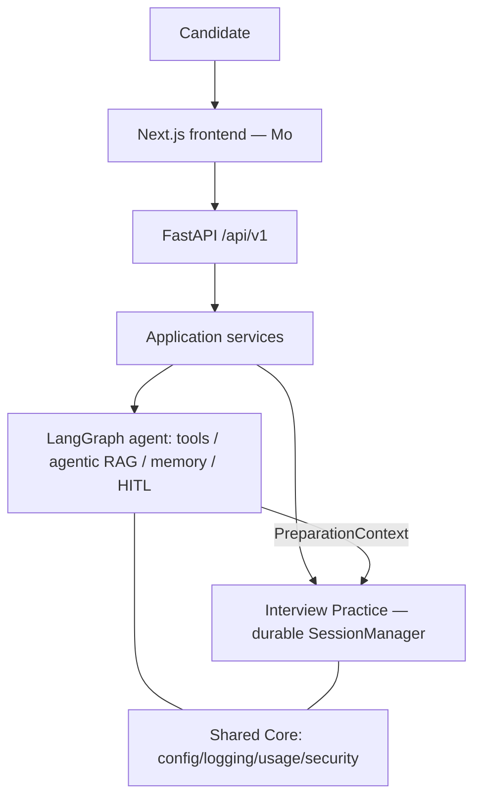
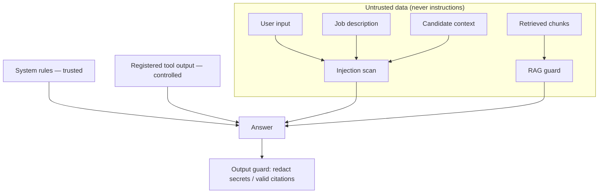

# Ask4Mo

**Intelligent Interview Coach**

**Ask More. Be More.**

Ask4Mo helps candidates understand what a role requires, prepare with evidence, practise
realistic interviews and improve through structured feedback.

**Mo** is the AI Coach. Underneath, Mo is a bounded **LangGraph Career Preparation
Agent** that chooses controlled tools, retrieves career evidence only when it is useful,
pauses for human approval where it matters, and hands the approved preparation into a
durable **Interview Practice** session.

## What it solves

When preparation for a job is spread across separate tools, feedback is hard to connect to
the role and to your own experience. Ask4Mo organises **preparation, practice and feedback
around one job at a time**, grounded in evidence and under the candidate's control. It is an
AI-assisted interview and career preparation platform for candidates (not recruiter, ATS or
HR software). Mo is AI and can make mistakes; interview feedback is practice guidance, not a
hiring decision.

**Target users:** candidates preparing for professional, specialist and leadership
interviews. Claims about the product must stay within
[docs/product/PRODUCT_CLAIMS.md](docs/product/PRODUCT_CLAIMS.md).

## The candidate journey

```
Opportunity  →  Prepare  →  Practice  →  Progress / History      (Mo is available throughout)
```

- **Opportunity** - a private space for one specific job (role, company, optional job
  description). Distinct from a Workspace, which is for sharing with other people.
- **Prepare** - Mo reads the role, compares your approved evidence, retrieves grounded
  career evidence when useful, builds a plan and tailored questions, and remembers only
  what you approve.
- **Practice** - a realistic interview (question, structured feedback, Deep Dive, final
  report). Answers can be typed or dictated where the browser supports it.
- **Progress / History** - return, review reports and prepare again.
- **Data & Privacy** (`/account/data`) - see what is stored, download a copy, remove
  individual items, revoke sharing, delete the account (with the limits listed below).

## Architecture at a glance

Primary product stack: **Next.js + FastAPI**. The authoritative architecture description is
[docs/sprint4_architecture.md](docs/sprint4_architecture.md) (start with its "Current-state
overview"); other documents are mapped in [docs/README.md](docs/README.md).

```
Next.js / TypeScript frontend (candidate UI, public site, English-only /admin console)
  → FastAPI (/api/v1): owner-scoped routes, safe error envelope, request ids
    → Application services (src/application)
      → Mo: bounded LangGraph agent  (allow-listed tools · three bounded specialists ·
            agentic RAG · approved memory · human-in-the-loop)
      → Interview Practice (durable sessions; LLM-backed question + evaluation services)
      → Documents/evidence, Opportunities, Workspaces/shares, Account lifecycle
    → Persistence (SQLAlchemy; Alembic migrations) · Knowledge stores + vector index
    → External provider adapters (LLM, email, speech, research) - optional, never in tests
```

Mo is the candidate-facing identity of one stateful, bounded LangGraph agent. It reaches
the three specialists (`role_opportunity`, `candidate_evidence`, `interview_strategy`)
only through allow-listed tools. **Interview evaluation is not a specialist or an agent**:
it is a separate LLM-backed service with a validated structured output. The registered
tool set is defined in code (`career_tool_registry`, `src/agent/registry.py`: six Career
tools, three specialist tools, two human-action tools).

## Authentication and security

- **Accounts:** email/password registration, email verification, password recovery and
  server-side sessions (opaque token in an HttpOnly cookie, 14-day TTL). Registration and
  recovery responses do not reveal whether an email exists.
- **Production is fail-closed:** a request without a valid session is `401`. A cookie that
  is present but invalid is `401`, never a downgrade.
- **Development only:** the `X-User-Subject` header and an anonymous developer identity are
  honoured only when `API_ENV` is `development`, `dev`, `test`, `testing` or `local`, and
  never over a valid session. Any other `API_ENV` value is treated as non-development.
- **Google OIDC:** a backend authorization-code flow exists (`/api/v1/auth/oidc/google/*`)
  behind `FEATURE_GOOGLE_LOGIN` and Google credentials. It is **off by default, has no
  sign-in button in the frontend and has not been validated live**. It is not a production
  login path today.
- **Known limits:** sign-in does not currently require a verified email; the rate limiter
  is in-memory by default (a shared Redis adapter exists behind `RATE_LIMIT_BACKEND=redis` + `REDIS_URL`
  but is optional, off by default and not validated against a live Redis, so distributed limiting is not
  claimed); production OIDC and live PostgreSQL validation are follow-ups.
- **Admin today (P10B-W10, qualified in W10.14):** a permission-based Admin control plane (`/admin`): users, access and workspaces,
  Support ticketing, plans/entitlements, **MOCK** billing, integrations and a read-only SecretStore, governed AI/model configuration,
  governed knowledge, durable jobs, privacy and legal operations, durable pause and restriction-only feature flags, aggregate reporting,
  and security/audit/incident management. 43 code-defined permissions and six least-privilege role presets (`platform_admin` is broad
  but not universal); no break-glass, no impersonation, and Admins are never a private-candidate-data superuser. Not built: Support
  attachments, Admin workspace deactivation, universal operator search, live billing, a production secret vault and external paging.
- **Prompt-injection and data-handling rules** are summarised below and in
  [docs/security.md](docs/security.md) and [docs/privacy.md](docs/privacy.md).

## Privacy and data control

Owner-scoped data; private by default. From `/account/data` a candidate can view stored
categories, **download** one JSON export (account, preferences, Opportunities, document
details and extracted evidence, stories, memories, interviews, feedback, memberships,
shares; not the original files), **delete** individual documents, memories, Opportunities
and interviews, **revoke** shares, and **delete the account**. Terms used precisely:
*delete* removes it now, *archive* hides but keeps, *revoke* stops future access (it does not
recall what was already seen), *unlink* detaches history from a deleted Opportunity,
*anonymise* removes the identity from retained security records. Details and limits:
[docs/privacy.md](docs/privacy.md).

## Localization and voice boundaries

Eight **interface locales** (en, de, fr, es, it, pt, nl, ru; `src/locales.py`) and the same
eight **Mo conversation languages**. These are separate dimensions that never imply each
other: **dictation, text-to-speech and realtime voice support seven languages** (not
Russian); document/OCR language, knowledge-base language and **labour-market geography**
are separate lists; **Russian is not an official ESCO language** and Russia is not a
supported labour market. Interface language never changes the labour market. Translations
other than English are engineering translations pending native/legal review. The slogan
**Ask More. Be More.** is never translated.

## Quick start

Two terminals, then open the app:

```bash
# Terminal 1 — FastAPI backend (http://localhost:8000, docs at /docs)
python -m venv .venv && source .venv/bin/activate
pip install -e .
AGENT_COACH_ENABLED=true OPENROUTER_API_KEY=... uvicorn src.api.main:app --reload

# Terminal 2 — Next.js frontend, the primary Ask4Mo UI (http://localhost:3000)
cd frontend && npm install && npm run dev
```

Open **http://localhost:3000**, type an interview goal on Home and press **Ask Mo**.

- **Minimum environment:** `OPENROUTER_API_KEY` (LLM-backed features) and
  `AGENT_COACH_ENABLED=true` (the Mo Agent Coach). The API's `FRONTEND_ORIGINS` defaults
  to `http://localhost:3000`. Advanced configuration (models, observability, speech/live)
  is covered under [Optional services](#optional-services) and the architecture docs.
- **Official interface:** Next.js + FastAPI. `streamlit run app.py` is a **legacy
  development interface only** — not the Ask4Mo reviewer experience.

### Knowledge base & citations (grounded evidence)

Mo shows **Sources/citations** only when retrieved career evidence is used, which needs the local knowledge base to be built. **Datasets
are not committed**, so a fresh checkout starts with an *empty* KB — Mo then falls back to
an explicit "insufficient verified evidence" state rather than inventing citations (this
is why citations may appear missing on a clean clone). Build it from the local-first
loaders (see [Career Intelligence](#career-intelligence--sprint-3-foundation-now-behind-mo)):
`source_status`, `download_sources`, `normalise_roles`, `load_competencies`,
`load_labour_market`, `load_compensation`, then `rebuild_vector_index`. Once built, a
retrieval-worthy question (e.g. *"What skills and responsibilities are important for a
registered nurse?"*) returns visible **Sources** with O*NET/ESCO citations (verified: 5
sources, lane `structured_role`).

**Before a reviewer demo, confirm readiness in one command** (no provider/LLM call):

```bash
python scripts/check_demo_knowledge.py      # → "DEMO KNOWLEDGE: READY" (exit 0)
```

It reports each structured store, the vector-passage count and a deterministic retrieval
smoke query, and exits non-zero with the exact build commands if the KB is not built (a
clean clone has no local indexes, so this is expected on a fresh checkout).

## Current limitations

Genuine present limitations (see also [docs/product/PRODUCT_CLAIMS.md](docs/product/PRODUCT_CLAIMS.md)):

- **PRIV-W9-01 and PRIV-W9-02 were closed in W10.10, with stated limits:** preparation runs are indexed per user from W10.10 onward
  (historical runs only from verified references) and deleted by the same account-deletion service; legal documents are versioned
  and acceptance is recorded from W10.10 onward (never back-filled; acceptance is not consent). Hosting backups follow the provider's
  retention and are not claimed instantly erased.
- **Russian speech is unsupported;** speech is seven languages. Non-English copy, including
  Russian and the legal/privacy text, is an engineering translation pending review; live
  generated-language quality is not yet validated; some European-language marketing copy
  still lacks diacritics; metadata localization and locale/bundle optimisation are pending.
- **Premium is a preview** (no purchase path, `BILLING_ENABLED=false`); Admin billing is MOCK and never changes anyone's access.
  Contact Support creates a ticket (no attachments); the Help Center itself is documentation.
- **Identity:** production OIDC and live PostgreSQL validation are not done; email
  verification is not required to sign in; rate limiting is per-process unless the optional, unvalidated Redis adapter is configured.
- The **knowledge base must be provisioned/built** for evidence-backed retrieval and
  citations (datasets are not committed). Sources are shown only when retrieved career
  evidence is used.
- **Live/realtime voice** is off by default and not live-validated; there is no camera or
  visual coaching.
- **Live-model tool-selection discipline is imperfect** - the real model sometimes answers
  well without invoking the discrete preparation tools (a measured model-behaviour signal;
  see `docs/sprint4_final_evidence.md`).
- Open engineering debt (Tailwind opacity-token architecture, test-isolation audit) is
  tracked in the roadmap, [docs/capstone/capstone_phase_plan.md](docs/capstone/capstone_phase_plan.md).

## Documentation

Map of canonical documents: [docs/README.md](docs/README.md). Roadmap: [docs/capstone/capstone_phase_plan.md](docs/capstone/capstone_phase_plan.md).

Reviewer package (Sprint 4 era; historical evidence unless a document says otherwise):

- [Final submission readiness](docs/final_submission_readiness.md) (canonical release-candidate status) · [Live golden result](docs/final_live_golden_result.md)
- [Submission summary](docs/sprint4_submission_summary.md) · [Reviewer guide](docs/sprint4_reviewer_guide.md) · [Reviewer Q&A](docs/sprint4_reviewer_qa.md)
- [Demo script](docs/sprint4_demo_script.md) · [Final requirements matrix](docs/sprint4_final_requirements_matrix.md)
- [Final evidence](docs/sprint4_final_evidence.md) (current verified test/eval numbers) · [Final evaluation](docs/sprint4_final_evaluation.md)
- [Architecture](docs/sprint4_architecture.md) · [Security & privacy](docs/sprint4_security_privacy.md) · [Interview parity](docs/sprint4_interview_parity.md)
- [Technical critique](docs/sprint4_technical_critique.md) · [Deliverable implementation stories](docs/sprint4_deliverable_implementation_stories.md) · [Post-release surface audit](docs/post_release_product_surface_audit.md)
- [Guided tutorial & Help experience](docs/guided_tutorial.md)

Evaluation commands (no paid calls by default):

```bash
python scripts/eval_agent.py                      # deterministic agent orchestration + gates (56 cases)
python scripts/eval_agent_live.py                 # live-model harness: safe, no paid call (22 cases)
python scripts/eval_agent_live.py --allow-paid    # explicit paid live-model run (opt-in)
```

Deeper / historical foundation is preserved below and in the linked docs.

---

## Reference & historical foundation

Everything below is deeper reference material: the current system architecture, and the
**Sprint 3 Career Intelligence** domain foundation that now runs *behind* Mo. It is not
required to understand or demo the product — start with the front door above.

### System architecture (foundation view)

This section describes the original module layering that still holds; the current end-to-end
view is above and in [docs/sprint4_architecture.md](docs/sprint4_architecture.md).

- **Shared Core** (`src/core/`) — infrastructure only: secrets, one composed `AppConfig`,
  safe logging, usage records, security primitives.
- **Career Intelligence** (`src/copilot/*`) — the domain engine: knowledge, retrieval,
  RAG, tools, security. Exposed to Mo through the agent's controlled tools.
- **Interview Practice** (`src/*.py`, `src/interview/*`) — the durable interview
  simulator (`SessionManager` state machine; question generation and answer evaluation are
  LLM-backed services with validated structured output).
- **Integration** (`src/integration/`) — the only cross-module surface: the typed
  `PreparationContext` handoff. Career and Interview never import each other.
- **FastAPI** (`src/api/*`) over `src/application/*`; **Next.js** (`frontend/*`) is the
  primary client; the **LangGraph agent** (`src/agent/*`) powers Mo. Full phase-by-phase
  detail lives in [docs/sprint4_architecture.md](docs/sprint4_architecture.md).


```mermaid
flowchart TD
    U[Candidate] --> FE[Next.js frontend — Mo]
    FE --> API[FastAPI /api/v1]
    API --> APP[Application services]
    APP --> AG[LangGraph agent: tools / agentic RAG / memory / HITL]
    APP --> IP[Interview Practice — durable SessionManager]
    AG -->|PreparationContext| IP
    AG --- CORE[Shared Core: config/logging/usage/security]
    IP --- CORE
```

**Trust / security boundaries**


```mermaid
flowchart TD
    SYS[System rules — trusted] --> OUT[Answer]
    TOOL[Registered tool output — controlled] --> OUT
    subgraph Untrusted["Untrusted data (never instructions)"]
      USER[User input] --> SCAN[Injection scan]
      JOBD[Job description] --> SCAN
      CAND[Candidate context] --> SCAN
      DOCS[Retrieved chunks] --> SCREEN[RAG guard]
    end
    SCAN --> OUT
    SCREEN --> OUT
    OUT --> OG[Output guard: redact secrets / valid citations]
```

Security highlights: prompt-injection scanning on all untrusted input; retrieved text is
**data, never instructions**; tools are a fixed registry (no `eval`/shell/network);
secrets via `SecretStr`, never logged; output guard redacts secret-like strings and keeps
citations valid. See [docs/security.md](docs/security.md).

### Career Intelligence — Sprint 3 foundation (now behind Mo)

The Career Intelligence layer began as the Turing College "Building Applications with AI"
(Sprint 3) deliverable and is now the **domain foundation used behind Mo** — not a second
product. Mo's `SearchCareerKnowledge` tool calls this engine's **retrieval-only**
operation: the agent decides *whether* to retrieve, while the deterministic router decides
*which* lanes/sources.

It is a **multi-source knowledge system**, not one vector store: a deterministic router
sends each question to the right lane across five stores — a **Role DB**
(ESCO/O*NET/ISCO/KldB/BLS OOH), a **Competency DB** (DigComp/NICE/e-CF/OPM/UK Civil
Service), a **Compensation DB** (OEWS/ASHE/Eurostat/Entgeltatlas), a **Labour-Market DB**
(Cedefop forecast/openings/shortage), and **Vector Knowledge** (narrative docs in Chroma)
— every record carrying provenance and source authority, with geographic precedence for
country-specific questions.

```
 Role DB   Competency DB   Compensation DB   Labour-Market DB   Vector Knowledge
     └──────────────┴──────────────┬──────────────┴───────────────┘
                          Deterministic Router (+ geo precedence)
                                    ↓
                        Grounded answer (with provenance)
```

The build is **local-first**: real source files under `data/raw/` are inventoried and
loaded in place; no datasets are committed. Reproduce with the `scripts/*` loaders
(`source_status`, `download_sources`, `normalise_roles`, `load_competencies`,
`load_labour_market`, `load_compensation`, `rebuild_vector_index`). Measured counts live in
[docs/metrics_snapshot.md](docs/metrics_snapshot.md); details in
[docs/knowledge_architecture.md](docs/knowledge_architecture.md),
[docs/knowledge_source_catalogue.md](docs/knowledge_source_catalogue.md) and
[docs/legacy_sprint3_architecture.md](docs/legacy_sprint3_architecture.md).

Representative sources (full list + licences in the catalogue):

| Source | Publisher | Group | Geo | Licence note |
| --- | --- | --- | --- | --- |
| O*NET | US DOL | occupations | US | CC BY 4.0 |
| ESCO | European Commission | occupations/skills | EU | review before reuse |
| ISCO-08 | ILO | occupation hierarchy | global | review before reuse |
| BLS Occupational Outlook Handbook | US BLS | occupations | US | public domain (US gov) |
| DigComp | European Commission (JRC) | skills | EU | review before reuse |
| NICE Framework | NIST | skills (cyber) | US | public domain (US gov) |
| OEWS / ASHE / Eurostat / Entgeltatlas | BLS / ONS / Eurostat / BA | compensation | US/UK/EU/DE | public domain / OGL / CC BY / review |
| Cedefop forecast / openings / shortage | Cedefop | labour market | EU | review before reuse |

**Controlled domain tools** (allowlisted; no arbitrary code). The Career tools are Job
Description Analyzer (LLM), Candidate Gap Analyzer (deterministic), Preparation Plan
Calculator (deterministic), Interview Question Generator (LLM), `SearchCareerKnowledge`
(retrieval-only) and `ResearchCurrentMarket` (bounded external research). They sit beside
three bounded specialist tools and two human-action tools; the complete, current list is the
registry in `src/agent/registry.py` (the single source of truth for tool counts).
See [docs/tool_calling.md](docs/tool_calling.md) for the original Sprint 3 design.

**RAG evaluation** is versioned and offline-first (deterministic retrieval metrics are the
CI gate; RAGAS is an optional, opt-in generation-quality layer that never runs in normal
CI). Current figures live in [docs/metrics_snapshot.md](docs/metrics_snapshot.md) and
[docs/sprint4_final_evidence.md](docs/sprint4_final_evidence.md); RAG design in
[docs/rag.md](docs/rag.md) and [docs/ragas_evaluation.md](docs/ragas_evaluation.md).

### Interview Practice (module)

Current candidate voice in the Next.js product is browser dictation, text-to-speech playback
and optional realtime voice (seven languages, off by default where it needs a provider); the
items below about Record and Live describe the legacy Streamlit path.

Realistic interview simulation: configuration (with restored Sprint-1 options — question
types, difficulty), durable sessions, tailored questions, structured evaluation, Interview
Deep Dive, final report, and refresh/restart resume. **Text Practice is complete**;
In the legacy Streamlit interface, **Record** (Google Speech) degrades to text without the `[speech]` extra; **Live** (Gemini)
is experimental and hidden behind `INTERVIEW_LIVE_ENABLED`. There is **no camera/visual
coaching**. See [docs/sprint4_interview_parity.md](docs/sprint4_interview_parity.md).

### Optional services

- **Record** (voice answers, legacy Streamlit interface): `pip install -e ".[speech]"` + a Google Speech project;
  degrades to text otherwise.
- **Live** (Gemini): experimental, OFF by default; needs `INTERVIEW_LIVE_ENABLED=true`,
  `pip install -e ".[live]"` and a key.
- **External observability (Langfuse):** optional, OFF by default; the first-party Agent
  Inspector is the primary view. Opt in with `pip install -e ".[observability]"` +
  `AGENT_EXTERNAL_OBSERVABILITY_ENABLED=true`; only a sanitised operational projection is
  ever sent.
- **RAGAS:** optional (`pip install -e ".[evaluation]"`), manual/paid, never in CI.

### Testing

```bash
pytest -q                                        # full Python suite
python -m compileall -q app.py src scripts tests # compile check
ruff check .                                     # lint
cd frontend && npm run lint && npm test && npm run typecheck && npm run build && npm run e2e
```

Current verified counts are kept in one place —
[docs/sprint4_final_evidence.md](docs/sprint4_final_evidence.md) — rather than duplicated
here.

### Historical Sprint documentation

This project began as a Turing College Sprint 1 interview app and grew into Ask4Mo. The
original standalone Sprint 1 manual was removed to avoid contradictory docs; it remains in
git history. Historical architecture notes:
[docs/legacy_sprint3_architecture.md](docs/legacy_sprint3_architecture.md) and the other
files under [`docs/`](docs/).
