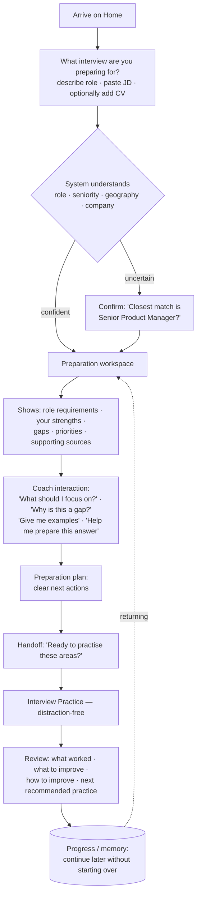

# User Flows

## Primary journey — from a job to interview-ready

**Step notes**

1. **Arrive** — one question, not a form. Role description, JD paste/upload, and
   an optional CV. Fields reveal progressively; never all at once.
2. **Understand** — resolve role/seniority/geography/company; if uncertain, a
   single confirm step (not a wall of questions).
3. **Preparation workspace** — requirements, strengths, gaps, recommended
   priorities, and supporting evidence.
4. **Coach** — plain-language questions and iteration. (The future LangGraph agent
   drives this; Phase 3A only designs the surface.)
5. **Plan** — concrete next actions.
6. **Practice** — distraction-free question → answer → feedback.
7. **Review** — strengths, improvement areas, actionable feedback, next practice.
8. **Memory** — resume preparation later.

## Secondary journeys

| # | Journey | Entry | Path |
|---|---------|-------|------|
| A | Returning user continues | Home / Progress | Progress → resume workspace at last state |
| B | No job description | Home | "Describe the target role" → manual role → workspace |
| C | JD but no CV | Home | Paste JD → workspace (strengths/gaps invite adding a CV, not required) |
| D | Wants only practice | Home / Practice | Straight to Practice; pick role/type → session |
| E | Wants a previous report | History | History list → open report |
| F | Reviewer / developer | Utility → Review & Diagnostics | Agent/RAG Inspector, Evaluation |
| G | Agent needs confirmation | inline in flow | Role-confirmation card (HITL) |
| H | Agent wants to remember | inline in flow | Memory-consent card (HITL) |

## Human-in-the-loop surfaces

Designed as natural coaching moments, not technical interrupts.

**Role confirmation**
> I think this role is closest to **Senior Product Manager**.
> [ Confirm ]  [ Choose another ]

**Memory consent**
> Remember these preparation priorities for next time?
> ☑ Executive communication ☑ Commercial ownership
> [ Save ]  [ Not now ]

**Handoff to practice**
> Ready to practise the areas we've identified?
> [ Start interview practice ]

Each appears **inline** in the preparation workspace, uses plain language, and is
always dismissible ("Not now" / "Choose another"). No memory is written and no
practice starts without an explicit tap.

## Cross-cutting states (every flow)

- **Empty** — "No preparation yet" + the single first action.
- **Loading / agent activity** — observable-action labels ("Reviewing the
  requirements"), never "Thinking…" or reasoning.
- **Insufficient information** — ask for exactly one missing item.
- **Error** — calm, actionable, no backend detail.
