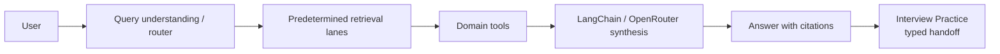
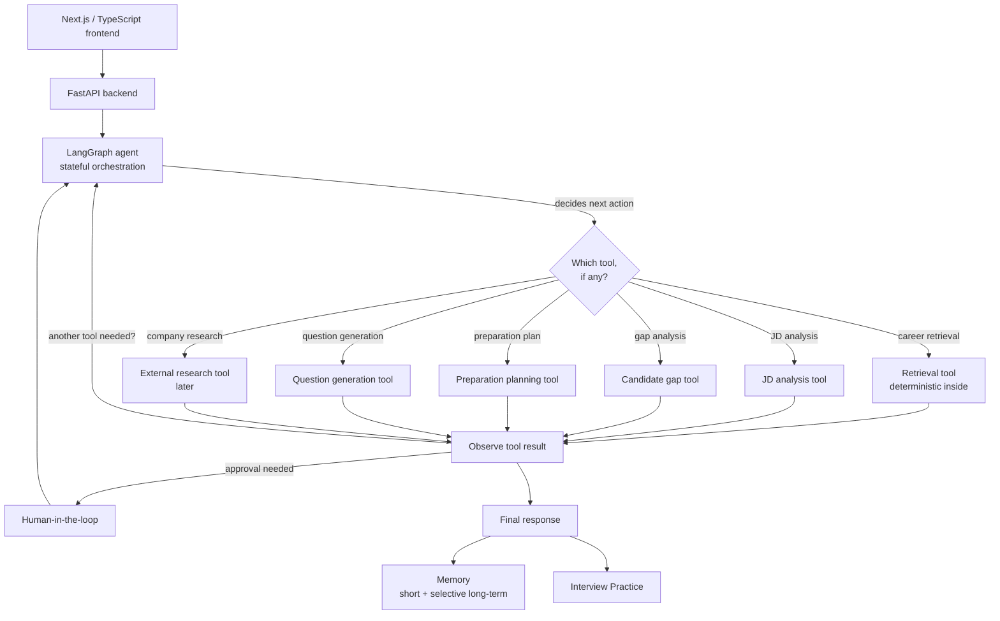

# Sprint 4 Architecture — Intelligent Interview Coach

This document records the **Sprint 3 → Sprint 4 evolution**, the agent
architecture decisions, and how Sprint 3 reviewer feedback is addressed in the
design. It is a **planning document**: nothing here is implemented in Phase 0.
The current shipping product is the Streamlit application described in the
[README](../README.md).

Status legend: ✅ **Current (Sprint 3, implemented)** · 🔷 **Planned (Sprint 4)**

---

## 1. Sprint 3 (current) request flow

In Sprint 3, **retrieval runs on (almost) every request** as a predetermined step
before synthesis. The router picks structured/hybrid lanes deterministically.

## 2. Sprint 4 (target) agent flow

### Key architectural statement (addresses reviewer feedback)

> **Retrieval will become an explicit agent-selectable tool** rather than being
> automatically required for every user request. The retrieval subsystem itself
> will **remain deterministic internally**, preserving structured/hybrid
> retrieval, geographic source precedence, evidence normalisation and citations.

The agent gains the *decision* of whether to retrieve; the retrieval *mechanics*
stay exactly as hardened in Sprint 3.

---

## 3. Agent architecture decisions

These are fixed now so later phases do not drift:

1. **Single primary agent**, not a multi-agent system.
2. **LangGraph** owns stateful orchestration.
3. **LangChain / OpenRouter** remain the model/tool integration layer.
4. **Retrieval becomes an explicit controlled tool.**
5. Existing **deterministic retrieval routing stays inside** the retrieval tool.
6. Existing **deterministic calculations remain deterministic Python.**
7. Existing **Python RAG and Interview logic remain Python.**
8. **Next.js / TypeScript** becomes the target frontend.
9. **FastAPI** becomes the target API boundary.
10. **Streamlit remains temporarily** as a migration fallback until parity is proven.
11. Important assumptions / memory writes use **human-in-the-loop approval.**
12. Agent loops are **bounded.**
13. **No private chain-of-thought is exposed**; only safe tool/action traces.
14. **RAGAS** remains the generation-quality evaluation layer.
15. Existing **security / privacy boundaries must be preserved.**

## 4. Internal naming is intentionally stable

To evolve functionality first and avoid churn/regression risk, Sprint 4 **does
not** rename internal identifiers:

- Packages: `src/copilot`, `src/career`, `src/interview`, `src/integration`,
  `src/core`, `src/ui`.
- Class names, database tables, migration identifiers, environment variable
  names, API/provider configuration names, stable persistence keys, and RAGAS
  artifact structures.
- The GitHub repository is **not** renamed in Sprint 4.
- No package-wide `copilot → agent` rename.

Only the **user-facing product name** changed (Interview OS Coach → Intelligent
Interview Coach). Bare "Interview OS" shell/architecture terms in code comments and
internal docstrings are internal references and are left as-is.

---

## 5. Sprint 3 reviewer feedback record

**Positive:**
- Strong code organisation.
- Clear, understandable project.
- Strong documentation; Mermaid diagrams helpful.
- Good developer habits; conventional commit prefixes.
- Dockerised app; environment templates.

**Improvement points:**
- Some referenced LLMs were outdated.
- Retrieval should be exposed as a **tool** rather than only a predetermined step.

**How Sprint 4 addresses them:**
- A **model registry / current-model review** will be added in a later Sprint 4
  phase (not changed in Phase 0, to avoid runtime behaviour change).
- **Retrieval becomes an explicit agent tool** (decisions §4 and §2 above), while
  the deterministic retrieval internals are preserved.

---

## 6. Current vs planned capability matrix

| Capability | Sprint 3 (current) | Sprint 4 (planned) |
|---|---|---|
| Career Intelligence | ✅ | ✅ (via agent tools) |
| Advanced RAG | ✅ | ✅ |
| Structured retrieval | ✅ | ✅ (inside retrieval tool) |
| Hybrid retrieval | ✅ | ✅ (inside retrieval tool) |
| Function / tool calling | ✅ | ✅ (agent-selectable) |
| RAGAS evaluation | ✅ | ✅ (extend to agent runs) |
| Interview Practice | ✅ | ✅ |
| Persistence | ✅ | ✅ |
| Authentication | ✅ | ✅ (adapt to API frontend) |
| Security guards | ✅ | ✅ (preserved) |
| Docker | ✅ | ✅ |
| CI / testing | ✅ | ✅ |
| FastAPI backend | — | 🔷 |
| Next.js / TypeScript frontend | — | 🔷 |
| LangGraph orchestration | — | 🔷 |
| Agent-selectable tools | — | 🔷 |
| Agentic RAG | — | 🔷 |
| Short-term memory | — | 🔷 |
| Long-term memory | — | 🔷 |
| Human-in-the-loop (HITL) | — | 🔷 |
| Agent Inspector UI | — | 🔷 |
| Agent evaluation metrics | — | 🔷 |

See also [sprint4_requirements_map.md](sprint4_requirements_map.md) and
[sprint4_roadmap.md](sprint4_roadmap.md).
