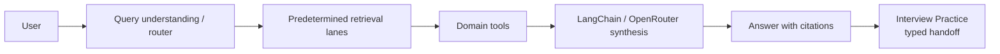
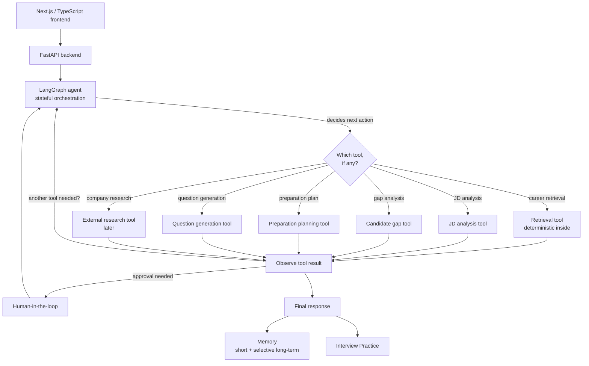
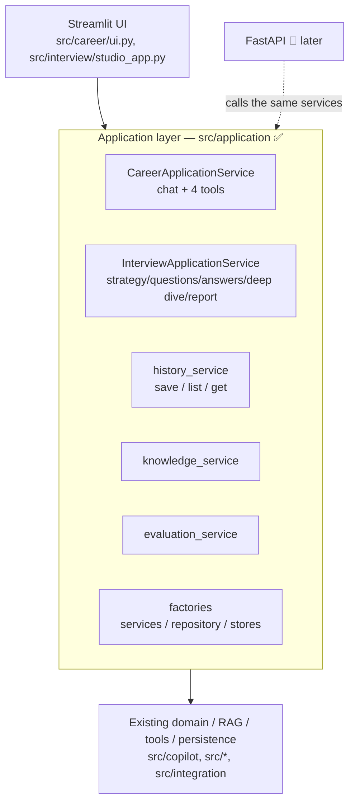
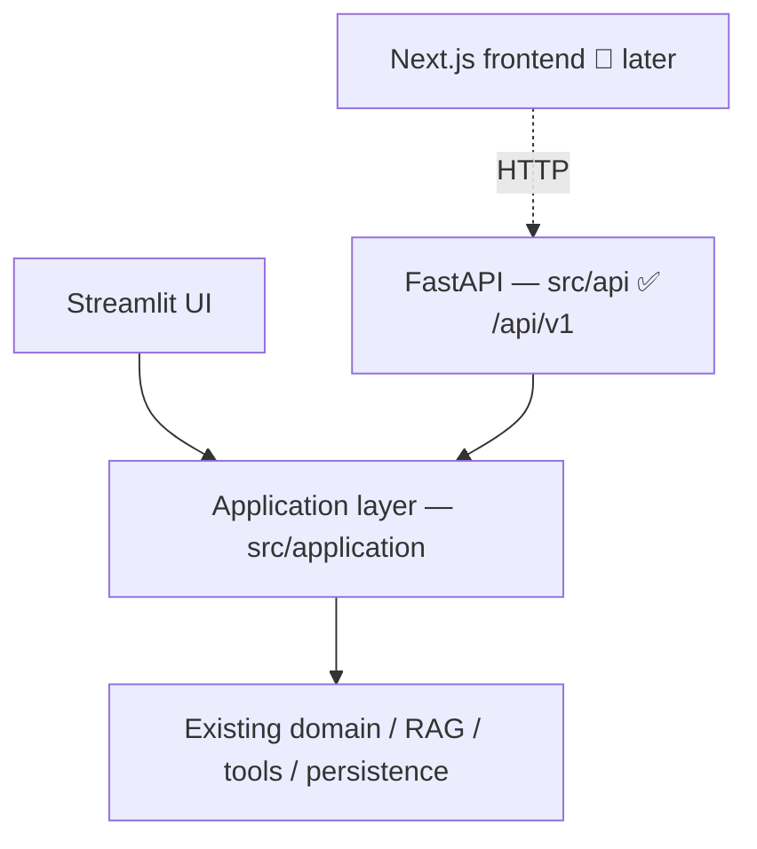
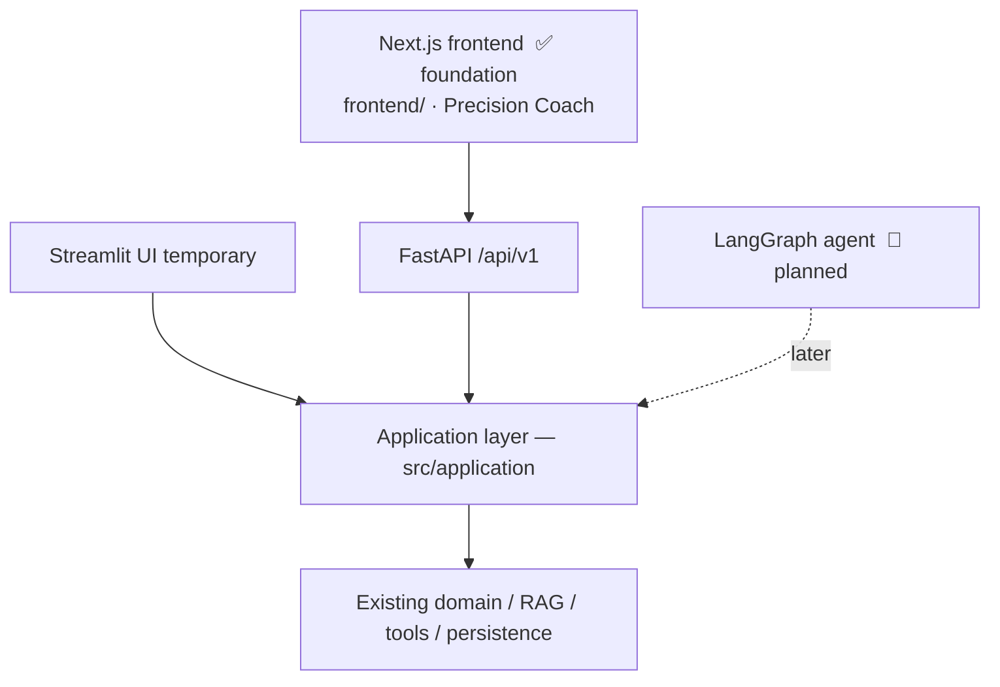
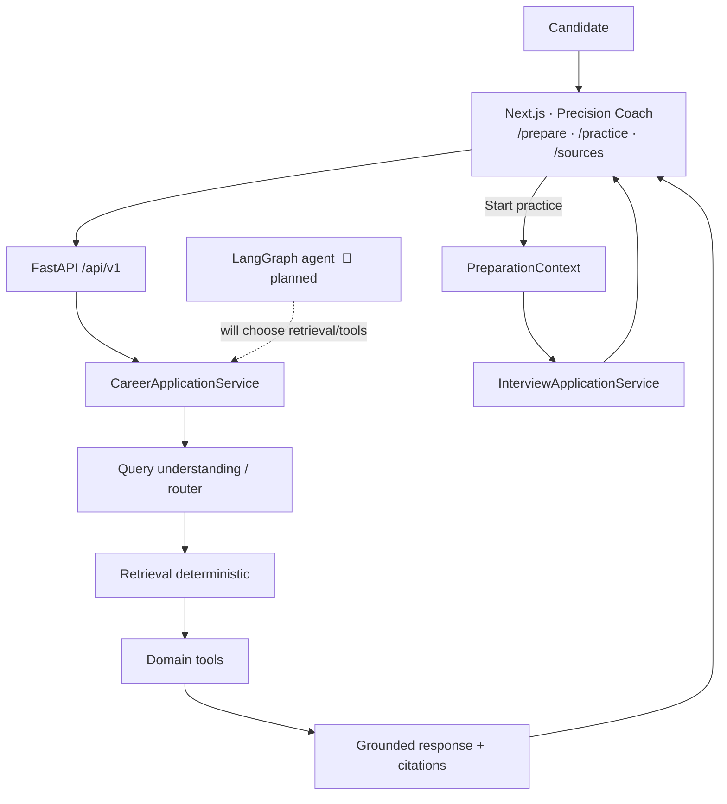

# Sprint 4 Architecture — Intelligent Interview Coach

This document records the **Sprint 3 → Sprint 4 evolution**, the agent
architecture decisions, and how Sprint 3 reviewer feedback is addressed in the
design. It is a **planning document**: nothing here is implemented in Phase 0.
The current shipping product is the Streamlit application described in the
[README](../README.md).

Status legend: ✅ **Current (Sprint 3, implemented)** · 🔷 **Planned (Sprint 4)**

---

## 1. Sprint 3 (current) request flow

In Sprint 3, **retrieval runs on (almost) every request** as a predetermined step
before synthesis. The router picks structured/hybrid lanes deterministically.

## 2. Sprint 4 (target) agent flow

### Key architectural statement (addresses reviewer feedback)

> **Retrieval will become an explicit agent-selectable tool** rather than being
> automatically required for every user request. The retrieval subsystem itself
> will **remain deterministic internally**, preserving structured/hybrid
> retrieval, geographic source precedence, evidence normalisation and citations.

The agent gains the *decision* of whether to retrieve; the retrieval *mechanics*
stay exactly as hardened in Sprint 3.

---

## 3. Agent architecture decisions

These are fixed now so later phases do not drift:

1. **Single primary agent**, not a multi-agent system.
2. **LangGraph** owns stateful orchestration.
3. **LangChain / OpenRouter** remain the model/tool integration layer.
4. **Retrieval becomes an explicit controlled tool.**
5. Existing **deterministic retrieval routing stays inside** the retrieval tool.
6. Existing **deterministic calculations remain deterministic Python.**
7. Existing **Python RAG and Interview logic remain Python.**
8. **Next.js / TypeScript** becomes the target frontend.
9. **FastAPI** becomes the target API boundary.
10. **Streamlit remains temporarily** as a migration fallback until parity is proven.
11. Important assumptions / memory writes use **human-in-the-loop approval.**
12. Agent loops are **bounded.**
13. **No private chain-of-thought is exposed**; only safe tool/action traces.
14. **RAGAS** remains the generation-quality evaluation layer.
15. Existing **security / privacy boundaries must be preserved.**

## 3a. Phase 1 — application boundary (implemented)

Phase 1 introduced a thin, **Streamlit-free application layer** (`src/application`)
so the existing capabilities are callable without Streamlit UI state or rendering.
Streamlit is now a *consumer* of these services; a future FastAPI backend will
call the same functions.

**What moved:** service construction (vector store, retriever, tool invoker,
interview/evaluation/report services, repository, pricing) into Streamlit-free
factories; Career chat/tools orchestration into `CareerApplicationService`;
interview strategy/question/answer/deep-dive/report orchestration into
`InterviewApplicationService` (driving a store-agnostic `SessionManager`);
persistence (payload build, duplicate-save guard, safe-failure handling) into
`history_service`; read-only knowledge/evaluation snapshots into their services.

**What did NOT change:** RAG/retrieval behaviour, tool execution, RAGAS scoring,
the interview state machine and scoring, the DB schema, auth, security guards, and
Live/Type/Record behaviour (Live stays flag-gated OFF). No FastAPI, Next.js or
LangGraph was added.

**Enforced by tests:** `src/application` imports no Streamlit and no UI module
(`tests/test_application_boundary.py`); the UI may import the application layer,
never the reverse.

## 3b. Phase 2 — FastAPI backend (implemented)

Phase 2 adds a thin, typed **FastAPI** backend (`src/api`) over the same
application layer. Streamlit keeps working unchanged; both call `src/application`.
FastAPI orchestrates HTTP concerns only — no Career/Interview/RAG/persistence/
RAGAS/security logic is duplicated in routes.

**Surface (`/api/v1`, plus `/api/health` liveness alias):**
- `GET /health`, `/ready`, `/capabilities`
- `POST /career/chat`, `/career/job-analysis`, `/career/gap-analysis`,
  `/career/preparation-plan`, `/career/questions`
- `POST /interviews`, `GET /interviews/{id}`, `POST /interviews/{id}/answers`,
  `/interviews/{id}/next-question`, `/interviews/{id}/complete`,
  `POST|GET /interviews/{id}/report`
- `GET /history/interviews`, `/history/interviews/{id}` (user-scoped)
- `GET /knowledge/sources`, `/knowledge/snapshot`
- `GET /evaluation/latest`, `/evaluation/runs`, `/evaluation/runs/{id}`,
  `/evaluation/ragas/configuration`

**Run locally:** `uvicorn src.api.main:app --reload` (interactive docs at `/docs`).

**Cross-cutting:** a server-generated `X-Request-Id` per request; a stable error
envelope `{"error": {code, message, request_id}}` (app errors → 422/503, unknown
→ safe 500, never a traceback/SQL/secret); CORS from `FRONTEND_ORIGINS` (never
wildcard-with-credentials).

**Resource lifecycle:** expensive resources (vector store, repository, pricing,
translation cache, configs) are built once and cached on `app.state` under a lock
(application-lifetime); `CareerApplicationService`/`InterviewApplicationService`
are cheap request-scoped wrappers. Nothing runs a provider/DB call at import.

**Interview session state (transitional):** in-progress interviews live in a
bounded, thread-safe, **user-scoped in-memory** store (`src/api/session_store.py`)
— the current schema persists only *completed* interviews. This is in-process
only (documented); durable in-progress session state is a later phase. Completed
reports still persist through `history_service`.

**Auth (transitional):** identity comes from the anonymous dev user unless an
`X-User-Subject` header is supplied (set only by a trusted upstream gateway or in
tests). History is strictly user-scoped (`repo.get_interview(user_id, id)`), so no
user can read another's reports. **Production must front the API with a real
authenticating gateway / OIDC** — see Phase 3/7.

**Deferred (documented):** Deep Dive HTTP endpoints (the application service
supports them; the surface is not yet exposed) and company-document uploads (the
existing limits are preserved in the domain; a secure multipart endpoint is a
later phase). No paid RAGAS run endpoint. **No Next.js and no LangGraph yet.**

## 3c. Phase 3B — Next.js frontend foundation (implemented)

Phase 3A selected **Concept D — Precision Coach**; Phase 3B builds the production
frontend *foundation* for it in `frontend/` (Next.js 15 App Router · React 19 ·
TypeScript · Tailwind). It is a typed client of the FastAPI backend; Streamlit keeps
working alongside it over the same application layer.

**Built:** the Precision Coach design system (tokens → CSS variables + Tailwind
theme, light/dark, no-flash), a restrained app shell (quiet header + mobile bottom
nav), the primary routes (Home, Prepare, Practice, Progress, History, Sources,
Review & Diagnostics + Agent/RAG/Evaluation, Settings) as scaffolds, a small
reusable component + UI-primitive foundation, a typed FastAPI client
(`lib/api/*`), and **live health/capabilities integration** (the Practice page
shows Live only when the backend reports `live_interview_enabled`). Frontend tests
(Vitest, 17) + a Playwright smoke (7) pass; Next.js → FastAPI integration verified
live.

**Deliberately NOT in 3B:** the full Career/Preparation migration (chat, JD/gap
analysis, planning, questions) — that's **Phase 3C**; the Prepare/Practice pages
are visual shells with clearly-marked demo content and an architecture ready to
swap in real API calls. No LangGraph, no model changes, Streamlit not removed.

**Auth (transitional):** the frontend has an auth *seam* (`lib/auth.ts`) only;
production OIDC/gateway is future work. A dev-only `X-User-Subject` may be set via
`NEXT_PUBLIC_DEV_USER_SUBJECT` for local data scoping — never typed by the browser
user.

## 3d. Phase 3C — live Career preparation experience (implemented)

Phase 3C makes `/prepare` real: the Next.js frontend now drives the existing
deterministic Sprint 3 Career Intelligence through the FastAPI contracts, and hands
a `PreparationContext` into a real interview session. No Career logic is duplicated
in TypeScript; retrieval is still deterministic (agentic RAG is Phase 6).

**What's live now:**
- **Prepare** — a coach composer + progressive "Add context" (job description, about
  you) posting to `POST /career/chat`; grounded answers render with candidate-facing
  **Career evidence** (citations/sources), an insufficient-evidence state, safe
  observable activity ("Checking career evidence…", never "thinking"), and safe
  errors with a request id.
- **Preparation tools** — all four connected: `job-analysis`, `gap-analysis`,
  `preparation-plan`, `questions`, rendering the real deterministic results.
- **Handoff** — builds a typed `PreparationContext` from gathered data and calls
  `POST /interviews`, then navigates to `/practice?session=<id>` (no extra LLM call;
  target-role precedence preserved).
- **Practice** — reads the real session (`GET /interviews/{id}`), showing the
  session's role + first question; a calm state when the model isn't configured.
- **Sources** and **History** — connected to `/knowledge/*` and `/history/*`
  (user-scoped) with real loading/empty/error states.

**One additive backend change** (§36): `InterviewStateResponse.target_role`
(optional) so the Practice page can show the session's role. Backward-compatible;
OpenAPI, Streamlit and user isolation preserved; guarded by
`tests/test_openapi_contract.py`.

**Still deliberately out:** LangGraph / agent tool-selection / memory / HITL; no
model changes; Streamlit not removed; no browser secrets (only `NEXT_PUBLIC_*`); no
private preparation data in `localStorage`. All Career requests still pass through
the backend security guards (validation, injection, retrieval/output guards, tool
allowlist) — the frontend never bypasses them.

## 4. Internal naming is intentionally stable

To evolve functionality first and avoid churn/regression risk, Sprint 4 **does
not** rename internal identifiers:

- Packages: `src/copilot`, `src/career`, `src/interview`, `src/integration`,
  `src/core`, `src/ui`.
- Class names, database tables, migration identifiers, environment variable
  names, API/provider configuration names, stable persistence keys, and RAGAS
  artifact structures.
- The GitHub repository is **not** renamed in Sprint 4.
- No package-wide `copilot → agent` rename.

Only the **user-facing product name** changed (Interview OS Coach → Intelligent
Interview Coach). Bare "Interview OS" shell/architecture terms in code comments and
internal docstrings are internal references and are left as-is.

---

## 5. Sprint 3 reviewer feedback record

**Positive:**
- Strong code organisation.
- Clear, understandable project.
- Strong documentation; Mermaid diagrams helpful.
- Good developer habits; conventional commit prefixes.
- Dockerised app; environment templates.

**Improvement points:**
- Some referenced LLMs were outdated.
- Retrieval should be exposed as a **tool** rather than only a predetermined step.

**How Sprint 4 addresses them:**
- A **model registry / current-model review** will be added in a later Sprint 4
  phase (not changed in Phase 0, to avoid runtime behaviour change).
- **Retrieval becomes an explicit agent tool** (decisions §4 and §2 above), while
  the deterministic retrieval internals are preserved.

---

## 6. Current vs planned capability matrix

| Capability | Sprint 3 (current) | Sprint 4 (planned) |
|---|---|---|
| Career Intelligence | ✅ | ✅ (via agent tools) |
| Advanced RAG | ✅ | ✅ |
| Structured retrieval | ✅ | ✅ (inside retrieval tool) |
| Hybrid retrieval | ✅ | ✅ (inside retrieval tool) |
| Function / tool calling | ✅ | ✅ (agent-selectable) |
| RAGAS evaluation | ✅ | ✅ (extend to agent runs) |
| Interview Practice | ✅ | ✅ |
| Persistence | ✅ | ✅ |
| Authentication | ✅ | ✅ (adapt to API frontend) |
| Security guards | ✅ | ✅ (preserved) |
| Docker | ✅ | ✅ |
| CI / testing | ✅ | ✅ |
| FastAPI backend | — | 🔷 |
| Next.js / TypeScript frontend | — | 🔷 |
| LangGraph orchestration | — | 🔷 |
| Agent-selectable tools | — | 🔷 |
| Agentic RAG | — | 🔷 |
| Short-term memory | — | 🔷 |
| Long-term memory | — | 🔷 |
| Human-in-the-loop (HITL) | — | 🔷 |
| Agent Inspector UI | — | 🔷 |
| Agent evaluation metrics | — | 🔷 |

See also [sprint4_requirements_map.md](sprint4_requirements_map.md) and
[sprint4_roadmap.md](sprint4_roadmap.md).
